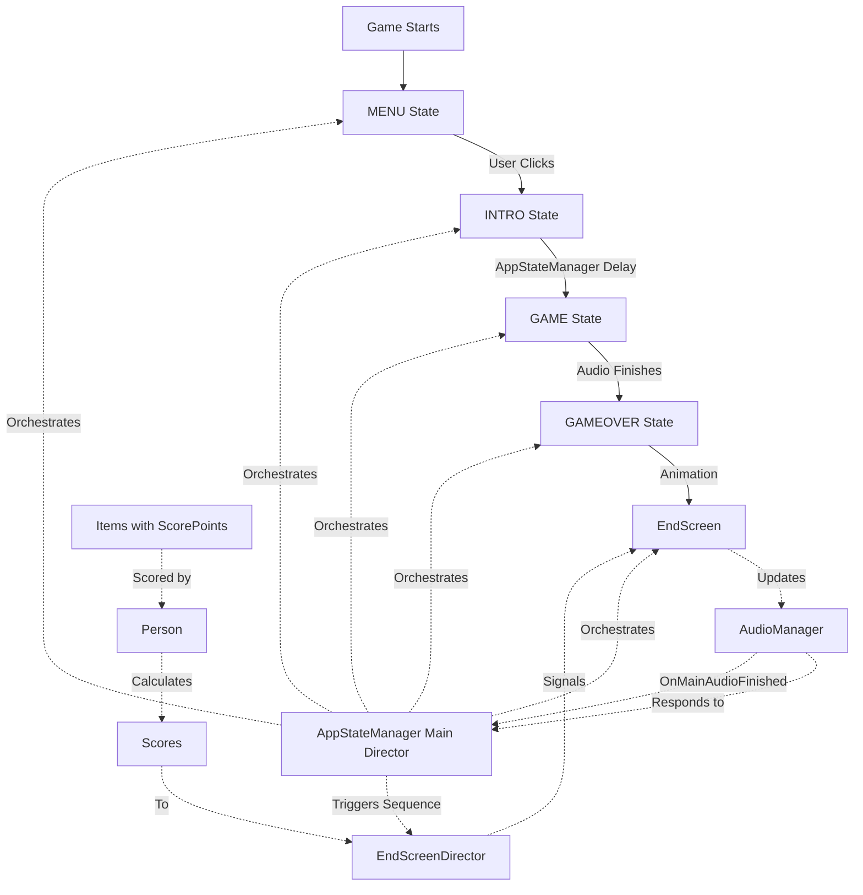

# CadaverEndeavour - System Architecture

## Overview

A drag-and-drop puzzle where players attach items to a dead body, scored based on family member preferences. The game uses a director model where `AppStateManager` orchestrates game flow through five states: MENU → INTRO → GAME → GAMEOVER → ENDSCREEN.

## Game Flow

1. **MENU** - Title screen with telephone. Clicking triggers transition to INTRO.
2. **INTRO** - Brief transition (2s default) before gameplay.
3. **GAME** - Drag items onto body while phone call plays. Items can be rotated; items leaving containment area respawn.
4. **GAMEOVER** - Items freeze, attached items reparent, body animates off-screen, then transitions to ENDSCREEN.
5. **ENDSCREEN** - Score sequence displays each family member's reaction with crossfading music.

## Core Systems

### State Management (Main Director)

**[AppStateManager](Scripts/AppStateManager.gd)** is the main director that orchestrates game flow:
- Manages state transitions (MENU, INTRO, GAME, GAMEOVER, ENDSCREEN)
- Coordinates scene visibility and audio transitions
- Handles attachment reparenting on GAMEOVER
- Triggers end screen sequence via `_sequence_family_scores()`

**[EnableOnState](scenes/EnableOnState.gd)**: Utility that shows/hides nodes based on current state. Used to toggle TitleScreen, Main Game, and EndScreen visibility.

### Audio System

**[AudioManager](Scripts/AudioManager.gd)**: Manages all audio playback:
- Title music (MENU/INTRO), game music + phone call (GAME), ending music (ENDSCREEN)
- Ending music crossfades between three tracks (happy/sad/neutral) based on scores
- Emits `OnMainAudioFinished` when phone call ends, triggering GAMEOVER

### Dragging System

**[MouseFollower](scenes/mouse_follower.gd)**: Detects clicks on "Grabbable" objects, follows mouse, applies rotation via wheel, calculates throw velocity.

**[DragElement](Prefabs/drag_element.gd)**: Base class for draggable items. Physics-based movement. Death/respawn: items leaving containment area darken/shrink over 0.75s, respawn if not rescued.

### Item & Scoring System

**[ItemPoints](scenes/item_points.gd)**: Loads item data from CSV, creates `ScorePoint` nodes for each point type.

**[ScorePoint](scenes/score_point.gd)**: Stores point type and amount. Items can have multiple ScorePoints.

**[PointType](scenes/point_type.gd)**: Enum for categories (Hunting, BodyPart, Nature, Dog, Cat, Eyes, Ears). Converts CSV strings to enum values.

### Person & Preference System

**[Person](playground/person.gd)**: Represents family members (Baby, Wife, Son). Loads preferences from CSV, calculates scores by scanning attached items' ScorePoints, applying preference multipliers, and adding baseline.

**[Preference](playground/preference.gd)**: Stores point type and multiplier (positive/negative).

**[Family](level/Family.tscn)**: Container with three Person nodes, each with CSV-loaded preferences.

### Attachment System

**[AttachmentScene](scenes/attachment_scene.gd)**: On GAMEOVER, finds overlapping grabbable objects, reparents them to attachment points, disables collisions, freezes items.

**Attachment Detection**: Person checks if items are attached by parent group membership or Area2D overlap.

### End Screen System

**[EndScreenDirector](level/end_screen_director.gd)**: Specialized director managing the score sequence timing:
- Configurable delays (`delay_until_first_person`, `time_per_person`)
- Emits `person_sequence_started` signal for each person
- Provides configurable durations (`music_crossfade_duration`, `person_movement_duration`)

**[EndScreen](level/end_screen.gd)** / **[end_screen.tscn](level/end_screen.tscn)**: 
- Responds to `EndScreenDirector` signals to display scores
- Triggers particle effects (hearts/tears) and person movement animations
- Updates `AudioManager` to crossfade music based on score (happy >1.0, sad ≤1.0)

## Scene Structure

**[Main.tscn](level/Main.tscn)**: Root scene containing TitleScreen (MENU), Main Game (INTRO/GAME/GAMEOVER), EndScreen (ENDSCREEN), and Family (always present).

**[TitleScreen](level/title_screen.tscn)**: Title UI with telephone. Uses EnableOnState for MENU visibility. [titlescreen.gd](playground/titlescreen.gd) handles click/shake animation.

**[Main Game](playground/Pau.tscn)**: Gameplay scene with dead body, MouseFollower, AttachmentScene, items, ContainmentArea. Uses EnableOnState for INTRO/GAME/GAMEOVER visibility.

**[EndScreen](level/end_screen.tscn)**: Score display with EndScreenDirector. Uses EnableOnState for ENDSCREEN visibility.

## Data Files

**[people.csv](resources/people.csv)**: Defines family member preferences (BASELINE score + multipliers per point type).

**[items.csv](resources/items.csv)**: Defines item point values per point type.

## System Interactions

### Key Interactions

1. **Director Pattern**: `AppStateManager` orchestrates game flow, managing state transitions and coordinating systems. Delegates specialized timing to `EndScreenDirector`.

2. **Audio Flow**: `AudioManager` responds to state changes. When game audio finishes, signals `AppStateManager` to transition to GAMEOVER.

3. **Scoring Flow**: Items have `ScorePoint` nodes. `Person` scans attached items, applies preference multipliers, calculates scores. Scores sent to `EndScreenDirector`.

4. **End Screen Flow**: `AppStateManager` triggers `EndScreenDirector` sequence. Director emits signals for each person. `EndScreen` responds with particles/movement, updates `AudioManager` for music crossfading.
