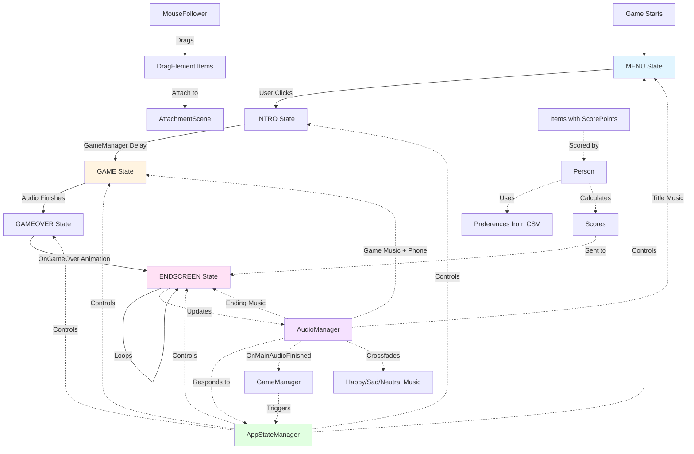

# CadaverEndeavour - System Architecture

## Overview

This document describes the game's systems and architecture, explaining how they work together to create the player experience. The game is a drag-and-drop puzzle where players attach items to a dead body, and the final result is scored based on family member preferences.

## Game Flow

The game follows a linear flow through five distinct states:

1. **Title Screen (MENU)** - The player sees the title screen with a telephone. Clicking the telephone triggers a shake animation and transitions to the intro state.

2. **Intro (INTRO)** - A brief transition period (2 seconds by default) before gameplay begins. The title music continues playing during this transition.

3. **Game (GAME)** - The main gameplay phase:
   - The player can drag items (antlers, eyes, buttons, etc.) onto the dead body
   - Background music and a phone call audio play simultaneously
   - Items can be rotated with the mouse wheel while dragging
   - Items outside the containment area will darken and shrink, then respawn at their starting position
   - The game continues until the phone call audio finishes

4. **Game Over (GAMEOVER)** - When the phone call ends:
   - All items freeze in place
   - Items attached to the body are reparented to attachment points
   - The dead body animates off-screen
   - After a delay, transitions to the end screen

5. **End Screen (ENDSCREEN)** - The scoring phase:
   - Displays scores for each family member in order: Baby, Wife, Son
   - Each person's score is shown for 3 seconds
   - The ending music crossfades between three tracks (happy, sad, neutral) based on each person's score
   - The sequence loops continuously

## Core Systems

### State Management

The game uses a centralized state machine to coordinate all systems.

- **[AppStateManager](Scripts/AppStateManager.gd)**: Singleton that manages the game state. States include MENU, INTRO, GAME, GAMEOVER, and ENDSCREEN. Emits `OnGameStateChanged` signal when state changes.

- **[EnableOnState](scenes/EnableOnState.gd)**: Utility script that can be attached to any scene node. Shows/hides the node and enables/disables processing based on whether the current state is in the `valid_states` array. Used to show/hide different scenes (TitleScreen, Main Game, EndScreen) based on state.

### Audio System

Manages all audio playback and responds to game state changes.

- **[AudioManager](Scripts/AudioManager.gd)** / **[AudioManager.tscn](Scripts/AudioManager.tscn)**: 
  - **Title Music**: Loops continuously while in MENU or INTRO states
  - **Game Audio**: Plays background music and phone call simultaneously during GAME state
  - **Ending Music**: Three separate tracks (happy, sad, neutral) that crossfade based on scores. All three play simultaneously at low volume, and the dominant track fades in based on the current person's score
  - Automatically transitions between audio based on state changes
  - Emits `OnMainAudioFinished` signal when the phone call ends

### Game Flow Control

Manages transitions between game states.

- **[GameManager](scenes/GameManager.gd)**: 
  - Listens for INTRO state and waits for an animation delay (default 2 seconds) before transitioning to GAME
  - Listens for `OnMainAudioFinished` signal from AudioManager and transitions to GAMEOVER state

- **[OnGameOver](scenes/OnGameOver.gd)**: 
  - Triggers when GAMEOVER state is entered
  - Animates the dead body off-screen using a tween
  - After the animation and delay, transitions to ENDSCREEN state

### Dragging System

Handles all mouse interaction for dragging items around the screen.

- **[MouseFollower](scenes/mouse_follower.gd)** / **[mouse_follower.tscn](scenes/mouse_follower.tscn)**: 
  - Detects mouse clicks on objects in the "Grabbable" group
  - Uses physics queries to find the topmost grabbable object under the cursor
  - Follows mouse position while dragging
  - Applies rotation via mouse wheel (scroll up/down)
  - Calculates throw velocity when releasing items
  - Uses RemoteTransform2D to control the dragged object's position and rotation
  - Manages z-index to ensure dragged items appear on top

- **[DragElement](Prefabs/drag_element.gd)**: 
  - Base class for all draggable items (extends Area2D, class_name InteractiveObject)
  - Physics-based movement with velocity and friction
  - Tracks whether it's inside a "ContainmentArea" 
  - **Death/Respawn System**: If an item leaves the containment area and isn't being dragged, it enters a "dying" state:
    - Darkens and shrinks over a grace period (0.75 seconds)
    - If rescued (dragged again) during this period, it revives
    - Otherwise, it respawns at its starting position after 0.5 seconds
  - Spawn protection prevents items from dying immediately after spawning

### Item & Scoring System

Items have point values that contribute to the final score.

- **[ItemPoints](scenes/item_points.gd)**: 
  - Loads item data from `resources/items.csv` based on item name
  - Creates `ScorePoint` nodes for each point type the item has
  - Attached to item scenes (Button, Eyes, Antlers, etc.)

- **[ScorePoint](scenes/score_point.gd)**: 
  - Stores a point type and point amount
  - Items can have multiple ScorePoint children for different categories

- **[PointType](scenes/point_type.gd)**: 
  - Enum defining point categories: Hunting, BodyPart, Nature, Dog, Cat, Eyes, Ears
  - Provides conversion between string keys (from CSV) and enum values

### Person & Preference System

Family members have preferences that determine how items are scored.

- **[Person](playground/person.gd)**: 
  - Represents a family member (Baby, Wife, or Son)
  - Loads preferences from `resources/people.csv` based on person type
  - Creates `Preference` child nodes for each preference type
  - **Score Calculation**: 
    - Scans all ScorePoint nodes in the scene
    - Checks if the item is attached (in an attachment area)
    - Groups points by type
    - Applies preference multipliers to each point type
    - Adds baseline points
    - Returns final score

- **[Preference](playground/preference.gd)**: 
  - Stores a point type and multiplier value
  - Positive multipliers increase score, negative decrease it

- **[Family](level/Family.tscn)**: 
  - Container scene with three Person nodes: Baby, Wife, and Son
  - Each person has their own preferences loaded from CSV

### Attachment System

Detects when items are attached to the dead body.

- **[AttachmentScene](scenes/attachment_scene.gd)** / **[attachment_scene.tscn](scenes/attachment_scene.tscn)**: 
  - Contains an Area2D that defines attachment zones on the body
  - When GAMEOVER state is entered:
    - Finds all grabbable objects overlapping the attachment area
    - Reparents them to the attachment point
    - Disables collisions and stops animations
    - Freezes items in place

- **Attachment Detection**: The Person system checks if items are attached by:
  - Checking if the item's parent is in the "Attachment" group
  - Checking if the item overlaps any Area2D in the "Attachment" group

### End Screen System

Displays scores and manages ending music.

- **[EndScreen](level/end_screen.gd)** / **[end_screen.tscn](level/end_screen.tscn)**: 
  - Activates when ENDSCREEN state is entered
  - **Score Sequence**:
	- Gets family members in order: Baby, Wife, Son
	- For each person:
	  - Calculates their score
	  - Displays name and score on screen
	  - Determines if score is happy (>1.0), sad (<0), or neutral (0-1)
	  - Updates AudioManager with scores to crossfade music
	  - Waits for crossfade duration + 3 seconds
	- Loops continuously while in ENDSCREEN state

## Scene Structure

The game is organized into a main scene that contains all sub-scenes, which are shown/hidden based on state.

- **[Main.tscn](level/Main.tscn)**: Root scene of the game containing:
  - **TitleScreen**: Shown during MENU state
  - **Main Game**: Shown during INTRO, GAME, and GAMEOVER states
  - **EndScreen**: Shown during ENDSCREEN state
  - **Family**: Always present, contains the three Person nodes

- **[TitleScreen](level/title_screen.tscn)**: 
  - Contains the title screen UI with telephone
  - Uses EnableOnState to show only during MENU state
  - Contains [titlescreen.gd](playground/titlescreen.gd) which handles the telephone click and shake animation

- **[Main Game](playground/Pau.tscn)**: 
  - The gameplay scene with:
	- Dead body (Guy node)
	- MouseFollower for dragging
	- AttachmentScene for attachment points
	- Various item instances
	- ContainmentArea for keeping items on screen
  - Uses EnableOnState to show during INTRO, GAME, and GAMEOVER states

- **[EndScreen](level/end_screen.tscn)**: 
  - Contains the score display label
  - Uses EnableOnState to show only during ENDSCREEN state

## Data Files

Game data is stored in CSV files for easy editing.

- **[people.csv](resources/people.csv)**: 
  - Defines preferences for each family member (Baby, Wife, Son)
  - Each row has a person name, BASELINE score, and multipliers for each point type
  - Example: Baby might have a high multiplier for "Cat" items and negative for "Hunting"

- **[items.csv](resources/items.csv)**: 
  - Defines point values for each item
  - Each row has an item name and point amounts for different point types
  - Example: "Antlers" might have points for "Hunting" and "Nature" types

## System Interactions

The following diagram shows how systems interact and the flow of states:

### Key Interactions

1. **State Changes**: AppStateManager is the central coordinator. When state changes, it emits a signal that all systems listen to.

2. **Audio Flow**: AudioManager listens to state changes and plays appropriate audio. When game audio finishes, it signals GameManager to transition to GAMEOVER.

3. **Scoring Flow**: 
   - Items have ScorePoint nodes with point types and amounts
   - Person nodes scan all ScorePoints in the scene
   - Only attached items (in Attachment areas) are counted
   - Person applies preference multipliers from CSV
   - Final scores are sent to EndScreen

4. **End Screen Flow**:
   - EndScreen gets scores from each Person
   - Determines emotional tone (happy/sad/neutral) based on score value
   - Updates AudioManager with scores
   - AudioManager crossfades between three ending tracks based on dominant emotion

5. **Dragging Flow**:
   - MouseFollower detects clicks and follows mouse
   - DragElement responds to being dragged (sets beingDragged flag)
   - On release, DragElement gets throw velocity
   - AttachmentScene detects overlaps and reparents items on GAMEOVER
